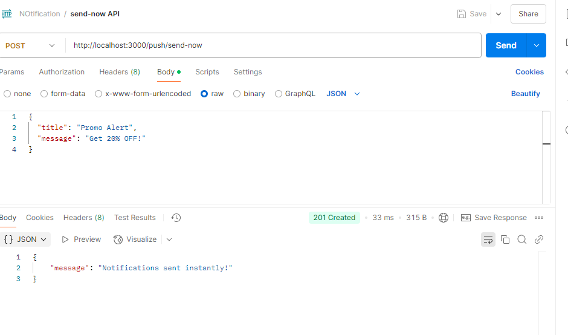
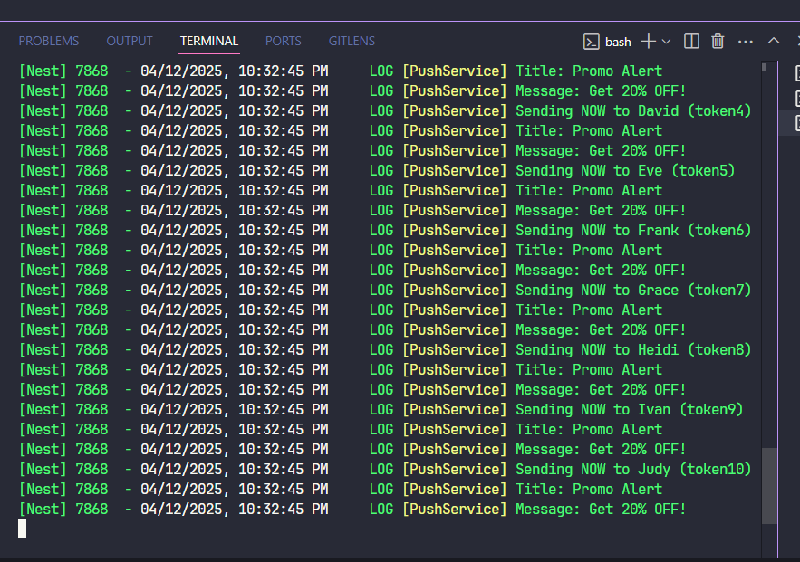
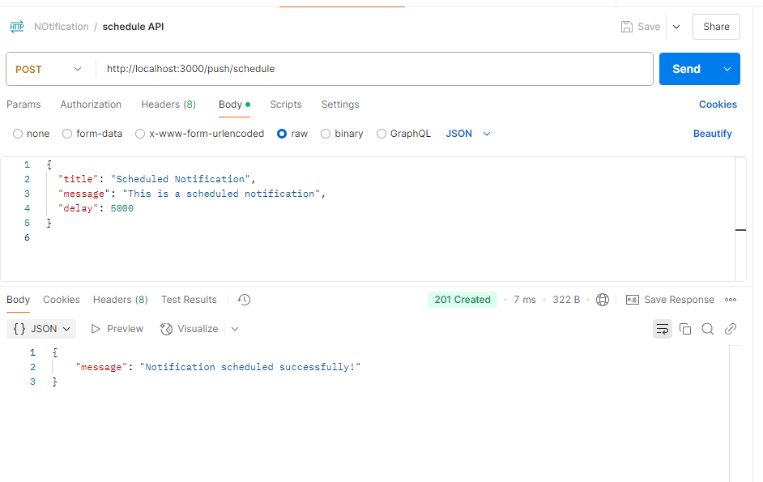
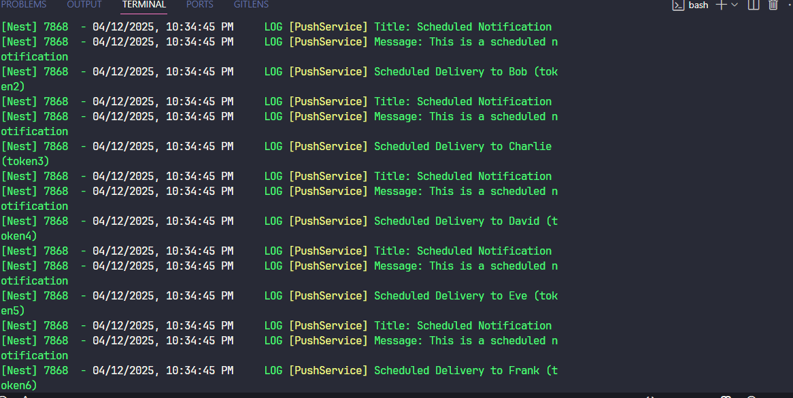

# Push Notification System using NestJS + Bull + Redis

## Overview

This project demonstrates a **NestJS-based push notification system** that:

- Simulates 10 users [Can use 40000 users also]
- Sends push notifications instantly
- Schedules push notifications using Bull Queue + Redis
- Displays notifications in the console (no Firebase integration)

---

## Features

### 1. Simulated User Model

- Simulates users with `id`, `name`, and `deviceToken`
- Uses mock data instead of a database

### 2. Push Notification Module

- `POST /push/send-now` — Sends message instantly to all users
- `POST /push/schedule` — Schedules the message to be sent later using Bull

## 📁 Project Structure

📁 push-notification-system/
├── 📁 src/
│ ├── 📁 push/
│ │ ├── dto/
│ │ │ ├── schedule.dto.ts
│ │ │ └── send-now.dto.ts
│ │ ├── push.controller.ts
│ │ ├── push.service.ts
│ │ ├── push.module.ts
│ │ └── push.processor.ts
│ ├── 📁 user/
│ │ ├── user.service.ts
│ │ └── mock-users.ts
│ ├── app.module.ts
│ └── main.ts
├── 📁 queue/
│ └── bull.config.ts
├── .env
├── README.md
├── package.json
└── tsconfig.json

## 🚀 Setup Instructions

### 1. Clone the Repository

bash
git clone https://github.com/Muhammad-AIUB/push-notification.git
cd push-notification-system

### 2. Install Dependencies

bash
npm install

### 3. Redis Installation (Required)

Make sure Redis is installed and running locally.

- Ubuntu:
  bash
  sudo apt update && sudo apt install redis-server

- Start Redis:
  bash
  redis-server

### 4. Start the App

bash
npm run start:dev

## 🧪 API Testing (via Postman or ThunderClient)

### 1. **Send Immediately**

- **POST** `/push/send-now`
  json
  {
  "title": "Promo Alert",
  "message": "Get 20% OFF!"
  }

- ✅ Console Output:

[IMMEDIATE] To John: Promo Alert - Get 20% OFF!

### 2. **Schedule Notification**

- **POST** `/push/schedule`
  json
  {
  "title": "Promo Alert",
  "message": "Get 20% OFF!",
  "scheduleAt": "2025-04-05T17:00:00.000Z"
  }

- ✅ Console Output (at the scheduled time):

[SCHEDULED] To Jane: Promo Alert - Get 20% OFF!

### 3.API's

post : http://localhost:3000/push/send-now

post:http://localhost:3000/push/schedule

##

Scheduling Logic Explaination

## How does it work?

When a request is made to /push/schedule:

The system adds a job to the Bull queue with the name sendPush.

This job contains the title, message, and scheduleAt time.

In push.processor.ts, using @Processor('pushQueue') and @Process('sendPush'):

When the scheduled time arrives, the job is processed automatically.

Using users.forEach(), the message is shown in the console for each user.
